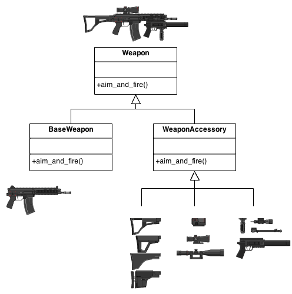
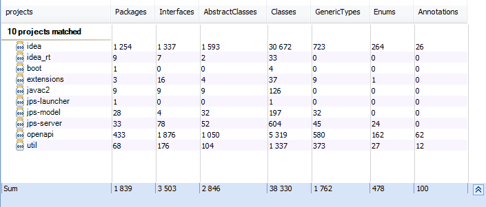
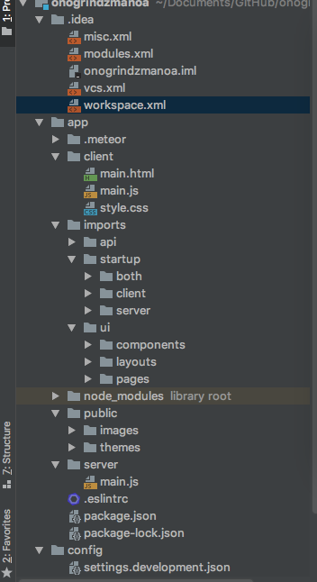

---
layout: essay 
type: essay 
title: What Are Design Patterns In Programming
date: 2018-11-26
labels:

--- 

The design pattern is a collection of re-used, mostly known, classified, code design experiences.

  The purpose of using design patterns: for code reusability, making code easier to understand by others, and ensuring code reliability. Design patterns make code writing truly engineered; design patterns are the cornerstone of software engineering, just like the structure of a building.

 

About IntelliJ IDEA Design Patterns:

  The first version of IntelliJ IDEA was released in January 2001, the first Java IDE to integrate advanced code navigation and code refactoring.
  
  In 2009, JetBrains opened up its community version. Since then, there have been many new IDEs based on their community version, such as Google's Android Studio.
This article uses JRarchitect as a tool to gain insight into the Intellij IDEA Community Edition and explore some of the internal design decisions used.
  
   

Modular:

  Intellij IDEA is organized in a modular way, using multiple projects. The main project is "idea", the tool class is implemented in the "util" project, and the jar of the "openapid" project contains the types needed to develop the Intellij IDEA plugin.

The following is a list of Intellij IDEA projects and related types of statistics.

  
	
