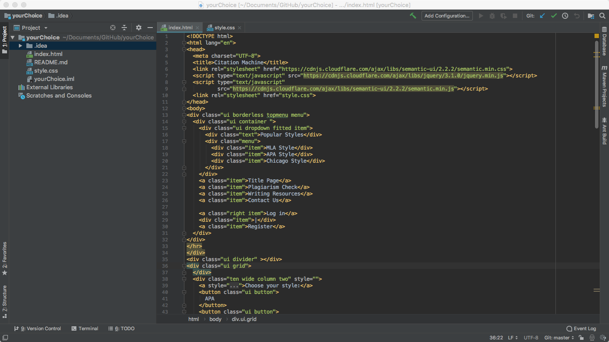
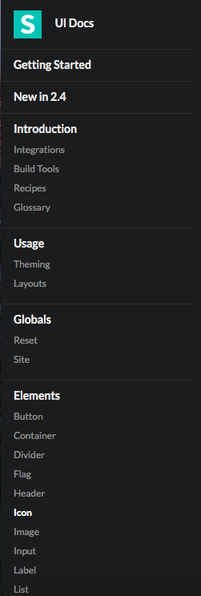

  During this week, I was exposed to ui design and semantic UI. At first I thought this was a difficult course because there were more complicated computer languages. But after a few WOD contacts, I found that using ui design is more concise, And many languages can be found on the homepage. The quality of UI design can only be judged by the experience of the designer. I also have some personal opinion about UI design.

I always thought that designing a good-looking website is a very complicated project that may require a lot of manpower and resources. But after learning the Semantic UI, I think this is actually a very simple project and can be done by one person. Some very complicated code (as shown below)

 

  I thought it was impossible to complete before studying this course.But in fact, you can find it on the Semantic UI page (as shown below).
  
   

So for me there is nothing more simple than copying and pasting.

 The use of Semantic UI is also very simple, just enter it in html (below)

 

 Semantic UI—The fully semantic front-end interface development framework is somewhat different from Bootstrap and Foundation. There are many differences in features, layout design, and user experience. For a while, I was a big fan of Zurb’s Foundation Framework, which has many features that other frameworks don't have, and it has a lot of pre-made templates. So using Zurb’s Foundation Framework to design it is relatively comfortable and fast. But the only thing is that some features have to wait until the new version of Foundation is released.
