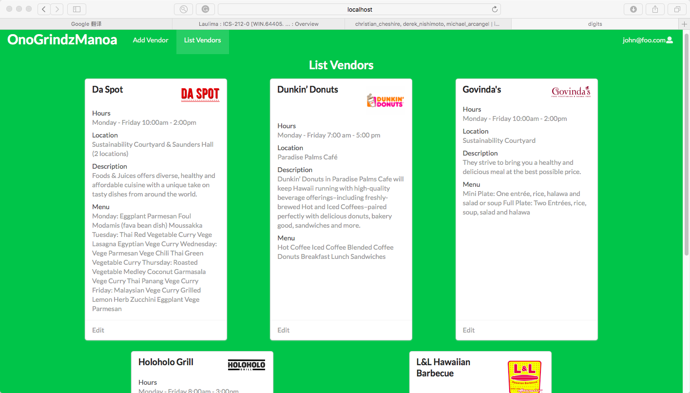

Once logged in, vendors can create a profile that provides information about them and their menu. Users will be able to search for vendors/menus that match their preferences. Administrators can to manage the app and view areas which may be restricted for other users.

We also provide a search function, available to those who can login to the system with their account and to public users. The search function allows users to display all vendors with a given favorite/preference for menu, style of food, quality of service, etc.

 
